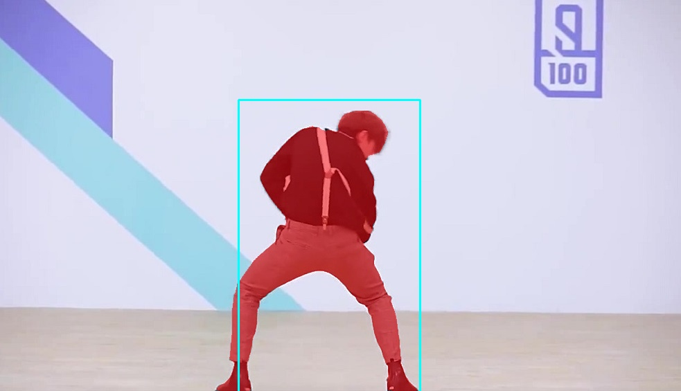

# segment-anything-ncnn
a ncnn example of segment-anything  

## PS:
1. the image_embeddings maybe take a long time, because of some MultiHeadAttention ops isn't fused.
2. maybe we should use pnnx to optimize this.

## model support:  
1. ViT-B SAM model 

models are available in [Baidu Pan](https://pan.baidu.com/s/15K_glUytv0A7qZFYpafsZw?pwd=naub) and [Google Drive](https://drive.google.com/drive/folders/1xo8DyWdeC_SNuz-K-Nm_E8C9OH3PcZ7S?usp=share_link)  

## Run  
```
mkdir -p build
cd build
cmake ..
make
./ncnn_sam
```

## time profile  
```
op type         avg time(ms)    %
Reshape         4888.25         36.39%
MatMul          2254.22         16.78%
InnerProduct    1887.95         14.06%
GELU            1856.38         13.82%
BinaryOp        1375.26         10.24%
Softmax         517.77          3.85%
Permute         442.16          3.29%
Crop            87.79           0.65%
LayerNorm       64.74           0.48%
Padding         36.62           0.27%
Convolution     18.11           0.13%
MemoryData      2.74            0.02%
Split           0.00            0%
total time:     13431.99
```

## Result   
### automatic_mask:  
  
### prompt points  
  
### prompt box  
  
 

## Reference  
1.https://github.com/facebookresearch/segment-anything  
2.https://github.com/Tencent/ncnn  
